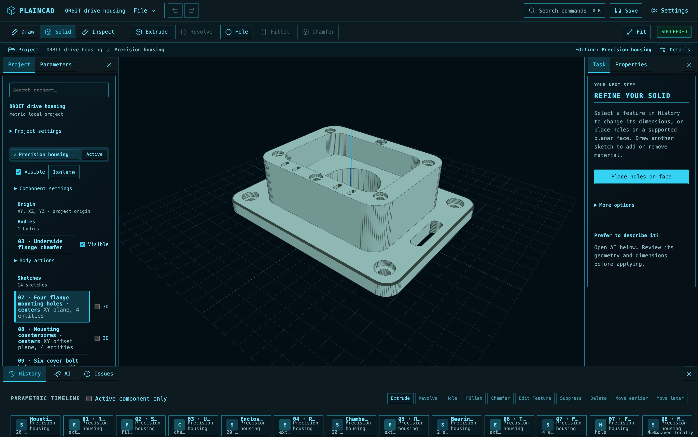

# PlainCAD

Browser-first, local-first parametric CAD for mechanical parts. Draw sketches,
create native solids, edit dimensions, and save an editable project or export STL.
Optional AI assistance supports Anthropic, OpenAI, and Google.

PlainCAD uses React 19, TypeScript, Vite, Zustand, Three.js, and OpenCascade.js.
CAD runs locally in the browser through a geometry worker. An optional local Node
gateway handles AI requests and keeps provider credentials out of the browser.



**ORBIT drive housing** — a real OpenCascade model with 16 features, 14 sketches,
and six editable parameters, shown in Saturn Command. The part includes a rounded
flange, fillet/chamfer treatments, a recessed chamber, bearing bore, counterbored
mounting and cover holes, and relief slots. [Open the editable example](docs/examples/orbit-drive-housing.pcaddoc)
with **File → Open**, or drop the project file onto the workspace.

Explore the [ten-project example gallery](docs/examples/README.md), from a two-part
cable guide to a 40-part rotary fixture, with editable files, native PNG previews,
[geometry validation](docs/examples/VALIDATION.json), and a
[workflow usability audit](docs/examples/WORKFLOW_AUDIT.md).

Successful builds show underconstrained-sketch freedom as optional guidance in
Issues. Kernel, profile, parameter, and worker problems remain prominent.
Parameters show their full names with a deliberate Rename action. While a rebuild
is pending, a previous value is explicitly labeled stale; invalid values show
Unavailable and cannot authorize export.

Parts use their component name in the browser, inspector, selected-part PNG, and
separate-part STL filenames. Multiple bodies in one component include their body name; duplicate
and unsafe filename collisions receive stable suffixes. Root-component projects
retain their existing part labels. Exit isolation restores component/part visibility
without revealing hidden source sketches.

The main Rectangle command opens the drawing tool with explicit Corner or Center
creation modes and optional typed width/height in the sketch properties panel,
leaving the canvas clear for mouse drawing. Driving dimensions stay visible
and editable by default; reference measurements appear for selected geometry or when Show
reference measurements is enabled. Finish Sketch returns the header to Solid tools. Existing fixed rectangle presets
remain in advanced commands. Center mode controls creation; later size edits retain the
existing corner-anchored solving behavior. Center snapping sets an initial position
without an associative center constraint.

## Features

- One local project file containing components, sketches, parameters, and a feature timeline.
- Mouse drawing, box/Shift selection, whole-shape deletion, and dimensions shown by default.
- Points, lines, circles, arcs, construction geometry, supported constraints, and driving dimensions.
- XY/XZ/YZ, offset, and supported feature-owned face sketch planes.
- Native Extrude, Revolve, Cut/Join, Hole, Fillet, and Chamfer with preview, Apply, and Cancel.
- Sketch Trim/Extend, Mirror, linear patterns, and bounded outline Offset.
- Guided face holes and pockets, extrusion distance handles, and supported operation drag-and-drop.
- Unit-aware parameter expressions, stable bindings, undo/redo, timeline ordering, and explicit reference repair.
- Docked Workbench, Minimal and Full layouts, and Light, Dark, and Saturn Command themes.
- Body visibility, named camera views, section previews, sketch measurements, and linked diagnostics.
- Editable `.pcaddoc`/JSON files, autosave/recovery, and validated single- or multi-body STL export.
- PNG downloads of the current 3D view, an isolated selected body, or a sketch with its visible dimensions.
- AI part creation, bounded existing-part edits/additions, and conversational sketch refinement.

Supported geometry is bounded. The [capability matrix](specs/working-cad/CAPABILITY_MATRIX.md)
records working behavior and limits; the [roadmap](specs/working-cad/PLAN.md) records
planned work. Unsupported or invalid operations produce diagnostics. Native
booleans and edge treatments must change actual geometry before they succeed.

## Quick Start

Requirements: Node.js `^20.19.0` or `>=22.12.0`, npm, and a modern desktop browser
with WebAssembly and WebGL support.

```sh
git clone https://github.com/dshills/PlainCAD.git
cd PlainCAD
npm ci
npm run dev
```

Open <http://localhost:5278>. Vite uses a strict port and reports a collision
instead of silently choosing another port. To override it:

```sh
npm run dev -- --host 127.0.0.1 --port 5288
```

Keep port 5279 free for the development browser tests.

To build and serve the production app locally:

```sh
npm run build
npm run preview
```

Preview uses strict port 5280. Static deployment, CSP, worker, and WebAssembly
hosting requirements are documented in [deployment/README.md](deployment/README.md).

## Project → Component → Sketch

A **project** is one local CAD file. A **component** organizes a part's sketches,
bodies, and features. A **sketch** contains editable geometry and design intent on
a plane. Parameters and timeline ordering belong to the whole project.

Components currently share the project origin. Modeling targets stay within their
component; supported face-plane references can use another component's upstream
geometry. Nested assemblies, placement transforms, joints, and linked designs
remain planned.

### Make your first part

1. On the empty project, enter **Part name** and choose **Draw a shape**.
2. Confirm a plane. PlainCAD creates the component and its first sketch together.
3. Choose **Rectangle**, **Circle**, or another drawing tool. Click or drag to draw;
   enter precise sizes or edit the drawing's dimension labels.
4. Choose **Finish Sketch**, select a highlighted closed region, then **Make solid**.
5. Inspect the Extrude preview, choose thickness and direction, then **Apply extrusion**.
6. Add holes or a pocket on a supported face, or create another sketch and cut/join it.
7. Edit a driving dimension or parameter, inspect the rebuilt geometry, then use
   **File → Save or export…** to download an editable project or printable STL.

For another part, choose **New Component**, activate it, and **Create Sketch**.
Selecting a sketch, body, or timeline feature activates its owner. Double-click a
sketch to edit it. **Mount Plate** and **Box** provide editable examples.

Feature tasks publish edits only after Apply. Cancel discards the preview; Apply
creates an undoable edit. New settings, project replacement, or a stale native
result invalidate Apply. Finish or cancel an active task before starting another.

### Workspace and themes

The default **Docked Workbench** places Project/Parameters on the left,
Task/Properties on the right, and History/AI/Issues at the bottom. **Draw**, **Solid**,
and **Inspect** change the context toolbar. **Project** and **Details** reopen docks;
drag their boundaries or use focused arrow-key controls to resize them.

**Settings → Workspace** also offers Minimal and Full layouts. Minimal keeps
Parts/History/Details behind disclosures; Full exposes the complete ribbon and
panels. Open the command palette with `Cmd/Ctrl+K` to find commands and see why
an unavailable action is disabled.

Choose Light, Dark, or Saturn Command with **Theme**. Saturn Command uses dark
instrument panels, cyan readouts, monospaced labels, and illuminated controls.
Layout, theme, visibility, and isolation are browser/session preferences rather
than CAD geometry. Named camera poses are saved explicitly in the project.

### Draw and dimension

Use points, lines, rectangles, circles, arcs, and construction geometry in the
plane-local canvas. Dimensions are on by default. Sized rectangles/circles create
driving dimensions; click an existing D label to edit its expression. Constraints
and diagnostics remain available through sketch controls.

Shift-click toggles selection. Box-select left-to-right for containment or
right-to-left for crossings. Delete/Backspace or the visible delete control removes
selected geometry and dependent intent in one Undo edit. Unused endpoints/centers
are cleaned up; shared points and surviving references remain.

Space-drag or middle-drag pans the sketch. Geometry snaps offer points, midpoints,
centers, alignment, and bounded intersection/tangent suggestions. Alt temporarily
bypasses snapping. Snaps do not automatically create constraints. Move, Translate,
and Deform provide supported edits with preview and cancellation.

**Trim** supports finite line/arc/circle intersections; trimming a circle produces
an arc. **Extend** supports lines and arcs; circles have no endpoints to extend.
Ambiguous overlaps and edits that would break protected intent are diagnosed.
**Mirror** copies selected geometry around a line/construction-line axis.
**Pattern** makes 2–16 total instances with a direction and spacing expression.
Copies preserve supported internal constraints, dimensions, and parameter bindings,
but are independently editable rather than associative pattern features.

**Offset** supports analytic circles and convex straight-line outlines. Circle
copies can retain supported expressions; polygon copies use a literal length and
a solved snapshot. Concave, mixed-arc, open, or collapsed outlines are diagnosed.
Existing openings require explicit **Outer boundary only**. These are ordinary
sketch copies rather than associative offset features.

### Edit parameters

Open **Parameters**, edit a name or expression, and press Enter or leave the
input to commit; Escape cancels the draft. With `width` defined, expressions can
reuse it:

```text
100mm
width - 20mm
width / 2
```

**Unit defaults** sets length/angle units for new or edited bare numbers. Each
expression retains its authored units, so changing defaults does not resize
existing geometry. Explicit units override defaults; mixed sums need compatible
units, such as `width + 10mm`. Scalar parameters support counts and ratios.
Parameter renames retain stable bindings; missing bindings require explicit repair.

### Navigate and inspect

Drag to orbit, right-drag or middle-drag to pan, and scroll to zoom in the 3D
viewer. Press **F** or choose **Fit** to frame visible bodies. The **Views** panel
offers Top, Front, Right, and Isometric views, plus saved named camera poses.
Body/component visibility and isolation change the view, not the export scope.

Use **Measure** for distances between solved sketch points or analytic line/arc/
circle measurements; choose display units without resizing geometry. Measurements
use authored sketch entities rather than arbitrary BRep surface picks. A section
preview clips along global X/Y/Z with an offset and retained side; it is an uncapped
visual view and leaves saved geometry and STL complete. Pending or failed rebuilds
hide stale measurements.

### Model and edit solids

| Operation | Supported workflow and main limits |
| --- | --- |
| Extrude | Closed line/arc/circle regions with holes; positive/negative/symmetric distance, New Body/Cut/Join, and through-all. Symmetric distance is the total span. |
| To Face | Positive extrusion to an upstream unmodified feature-owned planar cap/straight side; the full end section must fit the finite face, including openings. |
| Revolve | Closed analytic regions around a coplanar world X/Y/Z or same-sketch line axis; angles greater than 0 through 360 degrees; New Body/Cut/Join. Crossing the axis is rejected. |
| Cut/Join | Explicit saved upstream target IDs. Cuts must remove material from every target; joins must add material and produce one connected solid. Capture intersected targets is an explicit action. |
| Hole | Up to 64 explicit centers and target bodies, blind or through-all, in either sketch-normal direction. Every center must cut a target and every target must lose volume. |
| Fillet/Chamfer | Supported authored extrusion cap perimeters, complete line/arc/circle cap edges, and source-line side corners. Retained authored edges can work after supported booleans; lost/trimmed edges require repair. |

Create/Edit Feature uses native preview and separate downstream checks where
applicable. Select an authored solid dimension to edit its expression; for a bound
field, explicitly choose a shared parameter or replace only that feature's formula.
Formula-bound extrusion values keep their bindings and disable distance dragging
until an explicit replacement is chosen.

**Place holes on face** and **Draw here → Remove material** guide inward holes and
pockets on supported retained planar extrusion faces. Placement must clear the
actual face boundary and existing openings. Sampled curved boundaries use a
conservative clearance allowance. Extrude/Fillet/Chamfer operation tokens also
support drag, click, and keyboard target cards. The edge token picker is limited
to untouched distance/New Body Extrude caps and complete authored cap edges;
arbitrary BRep edges, vertical sides, and boolean-created topology are unavailable.

Use source-linked Issues and the Inspector to repair references. Timeline moves
preserve IDs and reject dependency violations. Failed operations retain upstream
previews while blocking dependent modeling and STL until repaired or suppressed.

## AI Assistance

AI is optional; ordinary drawing, modeling, and file commands work without a
provider. Open the bottom **AI drawer**. Review native geometry before applying
any proposal; clarifications and failed previews do not edit the document.

| Mode/scope | What it can do |
| --- | --- |
| New part | Create an editable component from bounded parametric recipes, including supported analytic profiles, openings, extrudes, revolves, holes, and cap treatments. |
| This part | Change eligible independent length/angle parameters used exclusively by the active component. Shared, locked, derived, and unused values are excluded. |
| Selected feature | Change supported Hole dimensions, distance Extrude thickness, or Revolve angle while preserving the feature's other settings. Changed fields explicitly replace their old binding. |
| Sketch editing | Local numeric/relation edits, or consent-based provider proposals for bounded dimensions, parameters, relations, and analytic Trim/Extend actions. |
| Add features to this part | Add up to four bounded hole, rectangular/circular pocket, or listed cap-edge Fillet/Chamfer operations on one explicit supported native face/body. |

Existing-part feature additions preserve existing IDs, parameters, and features.
Each proposed operation and the complete project must pass private native checks
before **Apply AI feature plan** creates one Undo edit. Mode changes preserve
descriptions/conversations, cancel pending previews, and reset feature-addition
sharing consent. New-part generation and feature-field edits retain their own
bounded scope and invalidation rules.

### Configure providers

```sh
cp .env.example .env.local
```

Fill the desired keys in the ignored `.env.local` and restart the server. Never
prefix API keys with `VITE_`, put them in project files, or commit them.

| Provider | Key | Model override |
| --- | --- | --- |
| Anthropic | `ANTHROPIC_API_KEY` | `ANTHROPIC_MODEL` |
| OpenAI | `OPENAI_API_KEY` | `OPENAI_MODEL` |
| Google | `GOOGLE_API_KEY` or `GEMINI_API_KEY` | `GOOGLE_MODEL` or `GEMINI_MODEL` |

Configured defaults live in [.env.example](.env.example) and
[the gateway configuration](server/aiProvider.ts). Use a model override above or
choose a model identifier in AI settings. Provider access and availability depend
on your account.

The gateway works with development and local Vite preview, accepts only loopback
same-origin requests, and keeps credentials on the Node server. Static-only hosting
has no AI endpoint. Shared/public AI requires a separate authenticated service.

Requests send your description and bounded recent conversation. Existing-part
parameter/feature modes also send their eligible edit context. Sketch and
feature-addition modes require explicit sharing consent and disclose the bounded
context: solved sketch intent or face bounds/IDs, eligible cap-edge choices, and
listed parameter names/expressions/values. Full project JSON and full meshes are
not sent. Chat and unapplied proposals stay out of project files. Provider requests
are bounded and use validated data, rather than generated executable CAD code.
See [AI feature additions](specs/working-cad/AI_FEATURE_ADDITIONS.md) and the
[capability matrix's AI sections](specs/working-cad/CAPABILITY_MATRIX.md#ai-component-generation)
for per-mode limits.

## Save, Recovery, STL, and Images

**Save** downloads one deterministic `.pcaddoc` with durable CAD intent. **Export
Project JSON** creates a `.json` copy. **Open** or a single project-file drop uses
bounded validation and supported migrations before replacement. Nonempty projects
get keep/save/replace choices when dropping a file.

Edited projects autosave to IndexedDB after 500 ms idle. Recovery retains up to
five projects with latest, previous, and last manually saved snapshots; startup
recovery is explicit. Storage/quota errors leave the in-memory project intact.
Download project files regularly: termination can lose edits before a completed
storage transaction. Current schema is 13, with checked-in schema 1–13 regression
fixtures and migrations.

**File → Save or export…** separates editable projects from printable STL. STL
requires a successful current rebuild with exportable geometry. Select bodies
explicitly; visibility does not silently change the export scope. Multi-body
export defaults to separate STL files in a ZIP. One STL with separate shells and
best-effort native union are also available. Exports retain global millimeter
coordinates. Disjoint unions remain separate solids and are reported.

The cancellable export worker validates coordinates, indices, degeneracy,
manifoldness, winding, shell/native volume, and bounded intersections. Combined
modes require acknowledgement of applicable warnings. Expensive checks may be
skipped outside union with a diagnostic. These checks cover supported meshes and
numerical tolerances; changed or stale results cannot be downloaded.

The viewport and native previews expose **Fit model** / **Fit preview** at compact
widths. Fitted views keep the complete model visible when docks or the canvas
resize; manual camera gestures and restored camera poses preserve their framing
until Fit is requested again. Fit uses both viewport dimensions.

The 3D view defaults to **Optimize while moving**: orbit, pan and zoom use at most
1× pixel density and hide model edge lines, then restore display detail about 100 ms after
the last camera input, without waiting for the damping tail. Turn this off in **Views** to keep full detail during
movement. **Show model edges** controls solid edge lines independently. These
choices are temporary view settings and reset when a project opens. Unchanged
bodies reuse viewer buffers and cached edge lines across rebuilds; changed or
removed bodies replace/dispose their own resources. The 3D view redraws for scene
changes and while the camera settles, then stops scheduling frames while idle.
Solid dimension labels follow the same updates. Visible sketch points share
instanced sphere batches (one each for normal/error colors) rather than issuing
a draw call per point; point identities, sizes, plane positions, and visibility
stay available.

Use **File → Download project view PNG** for the current 3D camera, visible bodies,
and section preview, without sketch overlays, selection highlights, or inspection
lines. Sketches used by unsuppressed modeling features start hidden in 3D when a
project opens; unused sketches stay visible. Use a sketch’s **3D** checkbox to
show it, or **Edit Sketch** to open its complete drawing. Component isolation and
**Show all bodies** preserve these sketch choices; **Show all components** also
shows every sketch. Select a body, then choose **Download selected
part PNG** for a fitted image of that body alone, without selection highlights or
section clipping. Open a sketch and choose **Download sketch PNG** in File or the
sketch header to include its visible dimensions and constraint annotations.
Images use the current theme, omit application controls and 3D dimension buttons,
and are capped at 4096 pixels per side. Sketch drawings render at twice their
display size; 3D captures always use the viewer's full display resolution, even
during movement. Project/part images
require a successful current native rebuild; sketch images require a valid solved
drawing. Downloads do not change the project, camera, visibility, or Undo history.

Project files contain components, parameters/bindings, sketches, planes, timeline
features, saved unit preferences, and explicit named camera poses. Kernel handles,
Three.js objects, meshes, rebuild results, transient camera/selection, and AI chat
remain runtime data.

### Resource limits

| Resource | Default limit |
| --- | --- |
| Project import | 5 MiB UTF-8 JSON, depth 64, 500,000 JSON nodes |
| Components / parameters / sketches / features | 100 / 500 / 100 / 1,000 |
| Sketch entities | 750 per sketch; 10,000 total |
| Constraints and dimensions, combined | 512 per sketch; 20,000 total |
| Feature dependency depth / bodies | 100 / 64 |
| Centers per Hole feature | 64 |
| Tessellation per body | 100,000 triangles; 300,000 vertices |
| Total tessellation / export intersection tests | 250,000 triangles / 2,000,000 tests |

## Development and Validation

| Command | Purpose |
| --- | --- |
| `npm run dev` | Vite development server, strict port 5278. |
| `npm run lint` | TypeScript application and browser-test checks; not an ESLint/style check. |
| `npm test` / `npm run test:watch` | Vitest unit/component tests, once or in watch mode. |
| `npm run build` | TypeScript checks and production output in `dist/`. |
| `npm run preview` | Local production preview, strict port 5280. |
| `npm run check:item` | Per-item reduced gate: type checks, all unit/component tests, build/bundle budget, development native modeling/stale-result smoke tests, and focused production modeling/AI/CSP tests. |
| `npm run release:check` | Type checking, unit/component tests, build, development Chromium acceptance, and built-app production CSP acceptance. |
| `npm run test:browser` | Native development Chromium suite, strict port 5279. |
| `npm run test:browser:smoke` | Development non-template modeling and stale-worker-result smoke tests, strict port 5279. |
| `npm run test:production` | Built-app Chromium CSP suite, strict port 5280; build first. |
| `npm run test:production:smoke` | Production CSP, Focused workspace, Workbench, and AI drawer smoke tests, strict port 5280; build first. |
| `npm run test:cross-browser` | Build plus production Chromium/Firefox/WebKit workflow and compact-layout checks, strict port 5281. |
| `npm run test:ai:browser` | Controlled AI corpus and Focused workflows on all three engines, development server on strict port 5281. |
| `npm run test:ai:live` | Opt-in live provider checks, strict port 5291. |

Every completed item requires Prism review with Anthropic `claude-sonnet-5-5`
and `npm run check:item`, plus focused tests for affected behavior outside the
smoke set. After every **five completed items**, run `npm run release:check`
before committing or handing off the fifth item. Count requested changes rather
than fixup commits, and record the count and check results in
[the validation log](specs/working-cad/VALIDATION_LOG.md). Reset the count only
after a successful full gate. A missing or uncertain count requires a full gate
to establish a baseline; failed checks must be fixed before moving on. The full
gate already includes the reduced checks, so item five needs one full run and
Prism review rather than two test runs.

Install Chromium before the per-item gate:

```sh
npx playwright install chromium
npm run check:item
```

For the additional three-engine suites:

```sh
npx playwright install chromium firefox webkit
npm run test:cross-browser
npm run test:ai:browser
```

Run focused tests with `npm test -- src/tests/document.test.ts`. Test suites own
their server ports and do not reuse an already-running server. Stop `npm run preview`
on 5280 before production tests, `check:item`, or `release:check`; the two suites on 5281 must run
separately. Screenshots/downloads/traces go to ignored `test-results/`;
use `npx playwright show-trace <trace.zip>` for a retained failure trace.

Native browser acceptance checks BRep validity, solid count, exact volume,
orientation, parameter edits, undo/redo, save/open, STL, and stale-result rejection
across supported workflows. jsdom and fallback meshes alone do not establish
native modeling. Cross-engine checks cover their named workflows; human usability,
complete accessibility, screen-reader speech, and actual browser/OS zoom evaluation
remain pending. Controlled performance reports are described in
[PERFORMANCE.md](specs/working-cad/PERFORMANCE.md).

CI runs the release gate plus separate AI and Workbench cross-engine jobs. Live
provider generation stays outside ordinary release checks and CI. To opt in:

```sh
PLAINCAD_LIVE_AI=1 npm run test:ai:live
```

This makes at most six requests for the checked-in sleeve and face-boss prompts,
with no automatic retries. Missing keys skip their provider; without the opt-in
flag, generation tests skip. Live calls incur provider charges and responses are
nondeterministic. See [review and validation evidence](specs/working-cad/NEXT_FIVE_REVIEW.md)
for the latest feature batch's reproducible checks and separate live smoke results.

## Repository Map

| Path | Purpose |
| --- | --- |
| `src/app/`, `src/ui/` | App shell, design system, panels, commands, and interaction tasks. |
| `src/cad/document/`, `src/state/` | Durable schema, validation/migrations, immutable history, and rebuild scheduling. |
| `src/cad/parameters/`, `src/cad/sketch/` | Units/expressions, sketch solving, profiles, and editing planners. |
| `src/cad/features/`, `src/cad/kernel/`, `src/cad/worker/` | Dependencies, OpenCascade, tessellation/STL, and worker lifecycle. |
| `src/viewer/`, `src/templates/` | Three.js rendering and editable example models. |
| `src/persistence/` | Import safety, deterministic project files, and recovery. |
| `src/ai/`, `server/` | Bounded AI plans and local provider gateway. |
| `src/tests/`, `e2e/`, `production-e2e/`, `cross-browser-e2e/`, `live-e2e/` | Unit, native browser, production, cross-engine, and live acceptance. |

See [AGENTS.md](AGENTS.md) for architectural rules and the contributor review,
validation, and commit workflow.

## Limits and Troubleshooting

Assemblies/joints, CAM, simulation, sheet metal, loft/sweep/shell/thread modeling,
STEP export, general surface modeling, and arbitrary topological naming remain
unavailable. Existing constraints, face/edge references, and AI recipes have the
supported scopes documented in the capability matrix. Native failures report
the source and preserve upstream previews for repair.

- **Port collision:** stop the conflicting server or choose a different explicit port.
- **Kernel/WebAssembly load failure:** check browser console, network requests,
  and deployment worker/WASM MIME and security headers. Modeling tasks require native geometry.
- **STL unavailable:** finish/cancel tasks, wait for the current rebuild, then repair
  or suppress failing features and select exportable bodies.
- **Import failure:** inspect the visible error for malformed/unsupported data or
  resource limits. The current project remains intact after a failed import.
- **AI unavailable:** configure server-side keys, restart Vite, and check the chosen
  model's account access. Static hosting has no local gateway.
- **Bundle size:** React, Three.js core/renderer, CAD logic, and the OpenCascade
  loader use separate production chunks. In the default Workbench, the sketch
  editor and AI drawer load when first opened and retain drafts when hidden.
  Legacy layouts load the AI drawer's separate chunk immediately to show its
  built-in toggle. `npm run build` enforces a
  500 kB uncompressed budget for every JavaScript bundle, including workers;
  Vite's default warning threshold remains unchanged. The kernel's separate
  WebAssembly asset is outside this JavaScript budget.

## Further Reading

- [Capability matrix](specs/working-cad/CAPABILITY_MATRIX.md), [working-CAD specification](specs/working-cad/SPEC.md), and [roadmap](specs/working-cad/PLAN.md).
- [Design system](DESIGN_SYSTEM.md), [first-part workflow](specs/working-cad/FIRST_PART.md), and [simplified workflow proposal](specs/working-cad/SIMPLIFIED_WORKFLOW.md).
- [Sketch handoff](specs/working-cad/SKETCH_SOLID_HANDOFF.md), [mouse tools](specs/working-cad/SKETCH_MOUSE.md), and [sketch refinement](specs/working-cad/SKETCH_REFINEMENT.md).
- [Trim/Extend](specs/working-cad/SKETCH_TRIM_EXTEND.md), [contextual constraints](specs/working-cad/CONTEXTUAL_SKETCH_CONSTRAINTS.md), [Mirror/Pattern](specs/working-cad/SKETCH_MIRROR_PATTERNS.md), and [Offset](specs/working-cad/SKETCH_OUTLINE_OFFSET.md).
- [Modeling tasks](specs/working-cad/MODELING_TASKS.md), [face pockets](specs/working-cad/FACE_POCKET.md), [solid dimensions](specs/working-cad/SOLID_DIMENSIONS.md), [inline editing](specs/working-cad/INLINE_SOLID_DIMENSIONS.md), and [individual cap-edge picking](specs/working-cad/INDIVIDUAL_CAP_EDGE_PICKING.md).
- [AI feature additions](specs/working-cad/AI_FEATURE_ADDITIONS.md), [readiness guidance](specs/working-cad/READINESS_GUIDANCE.md), and [latest batch review](specs/working-cad/NEXT_FIVE_REVIEW.md).
- [Workbench validation](specs/working-cad/WORKBENCH_VALIDATION.md), [cross-engine usability checks](specs/working-cad/WORKBENCH_USABILITY_CHECKS.md), and [editing usability audit](specs/working-cad/EDITING_USABILITY_AUDIT.md).
- [Original MVP specification](specs/initial/SPEC.md), [completion review](specs/initial/MVP_COMPLETION.md), and [deployment guide](deployment/README.md).
