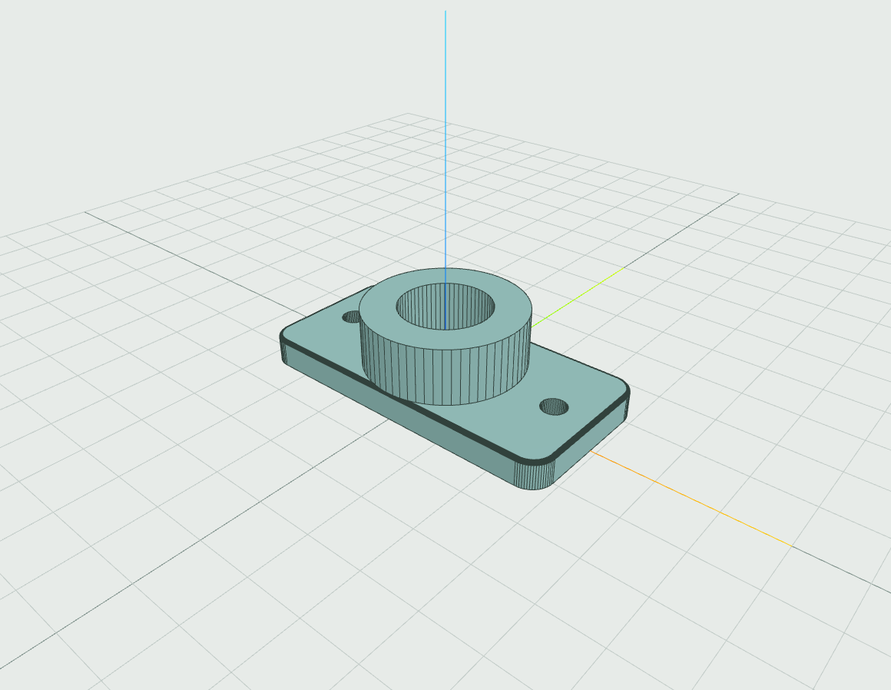
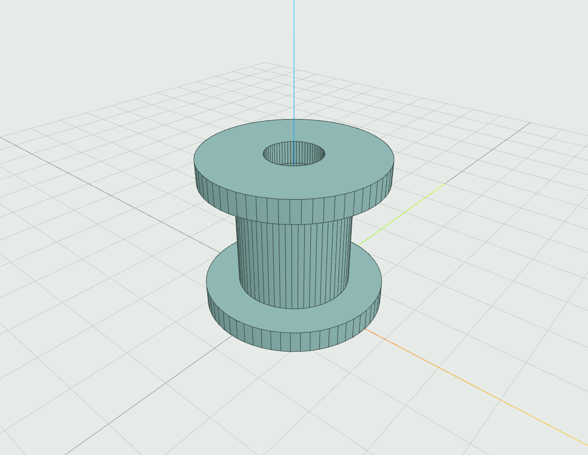
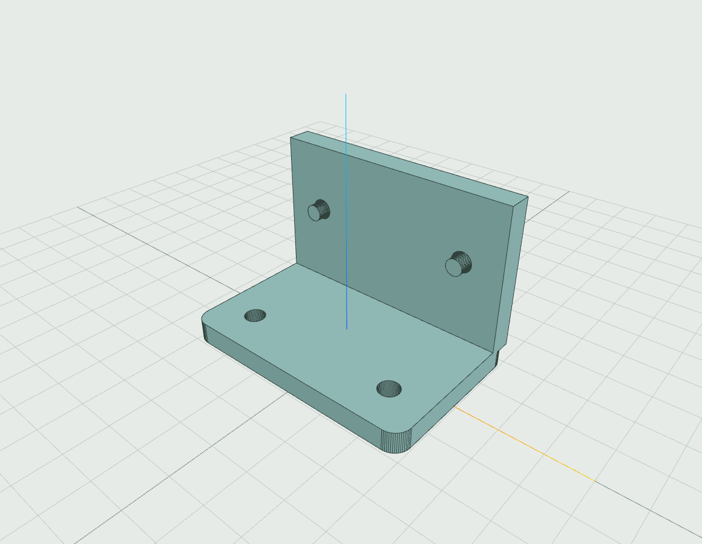
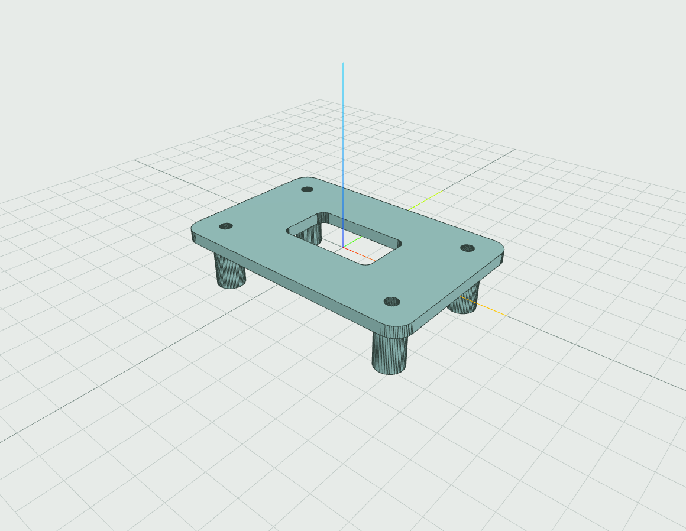
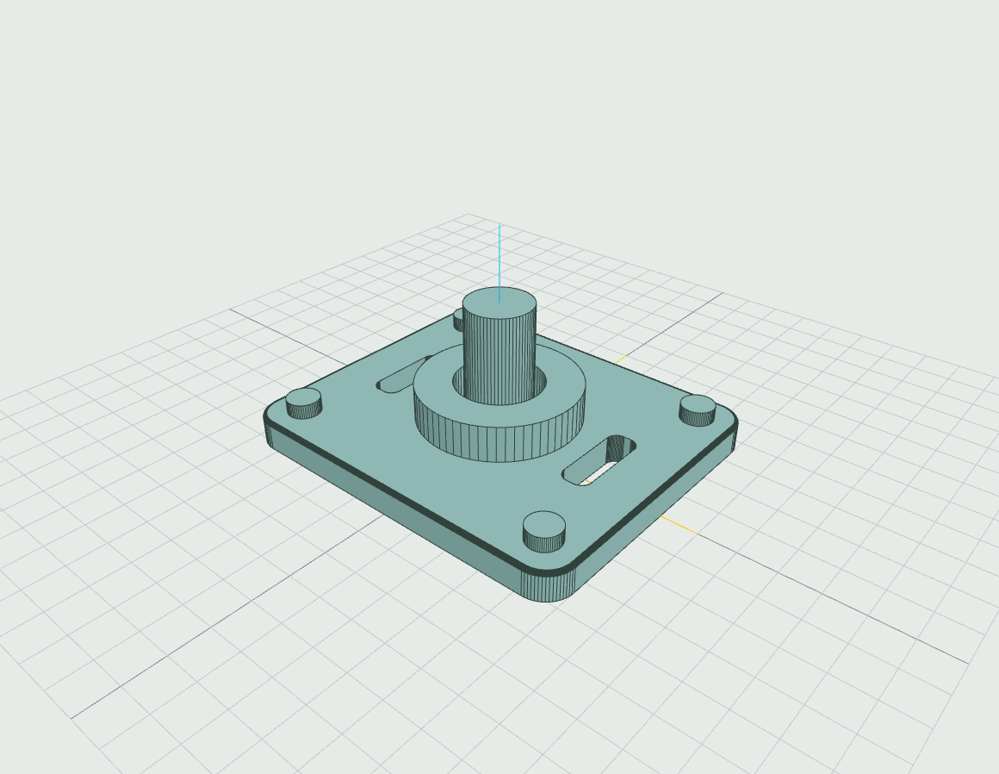
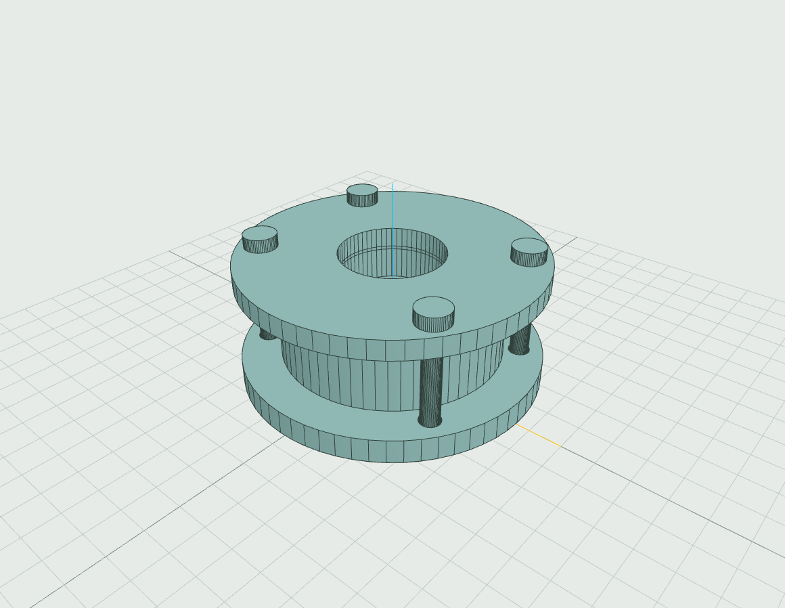
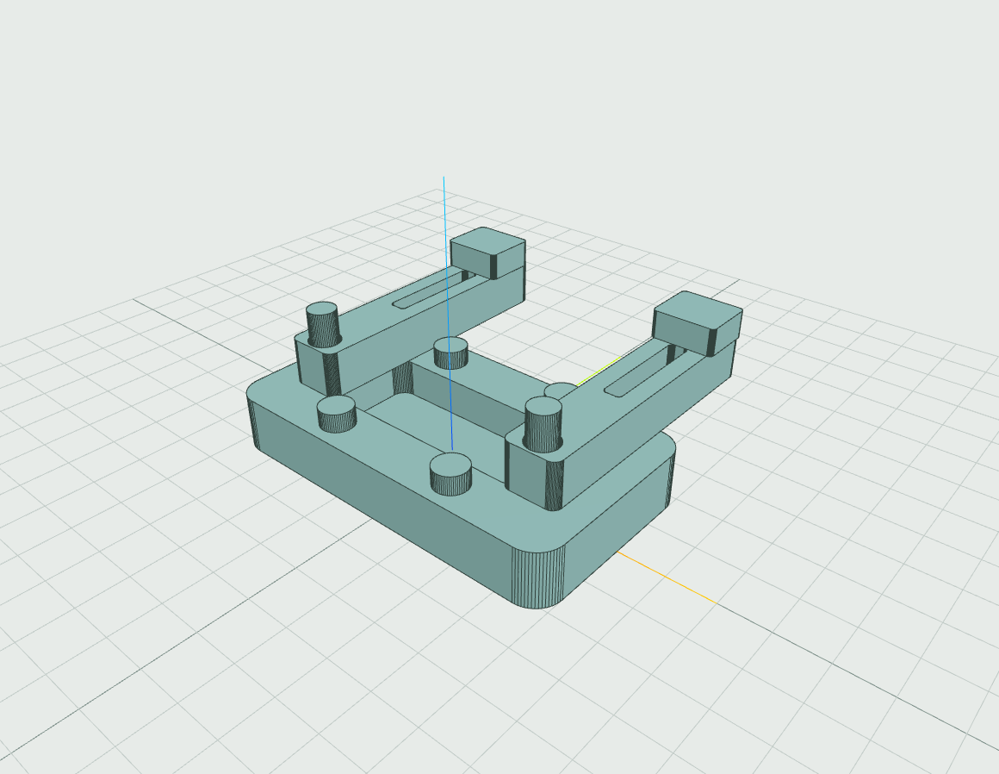
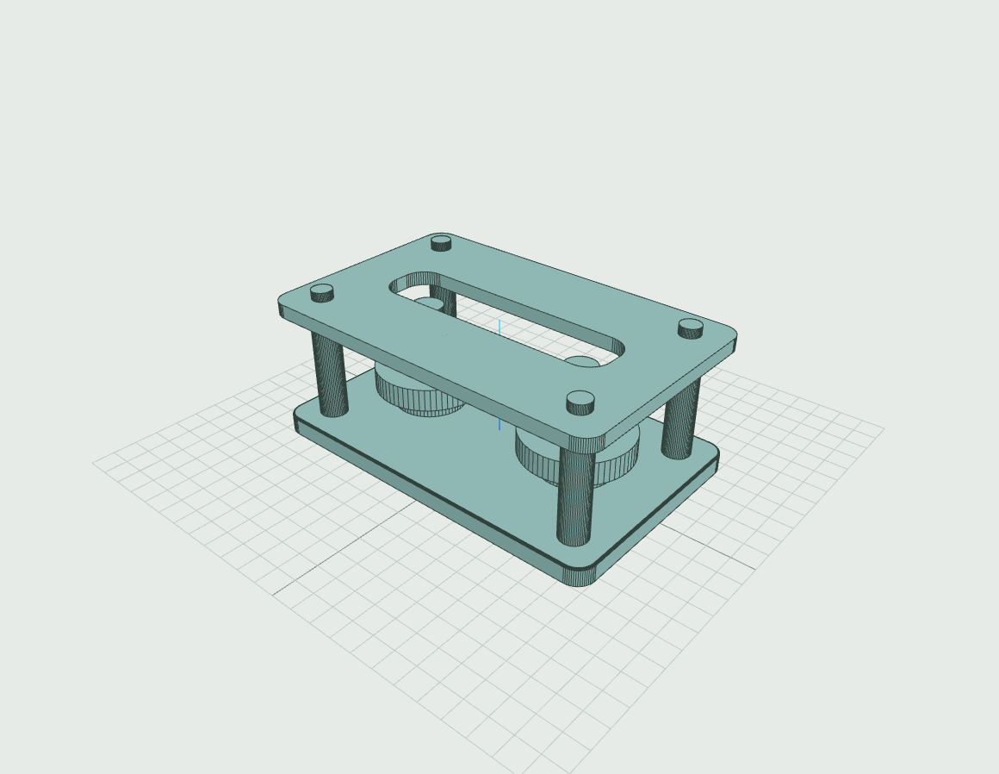
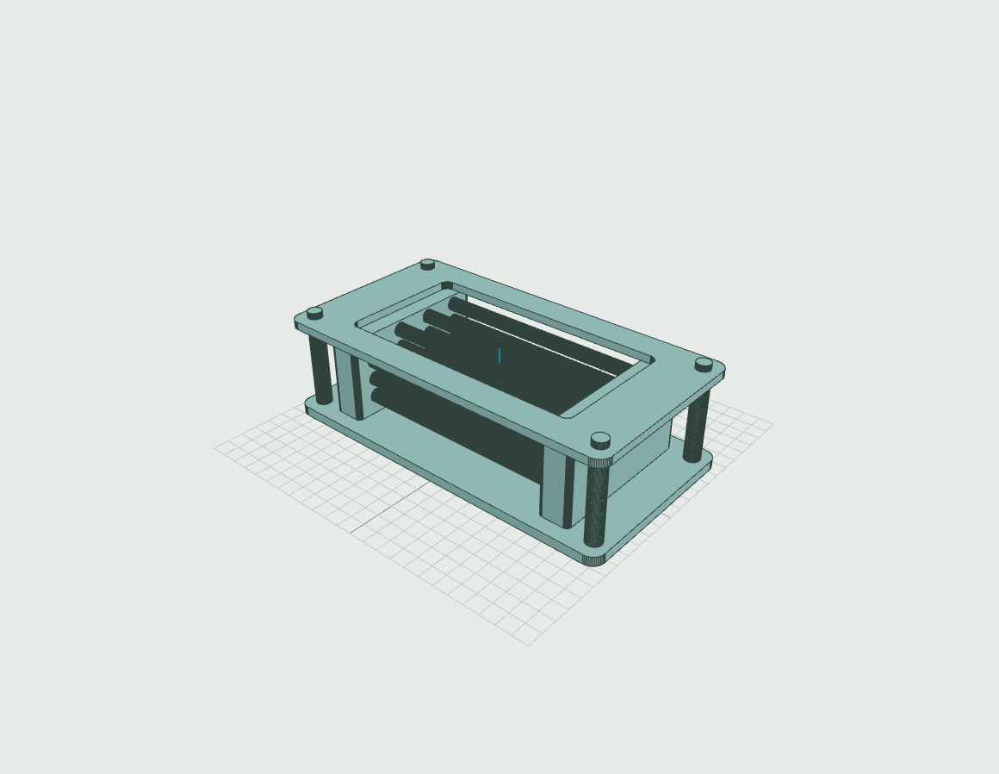
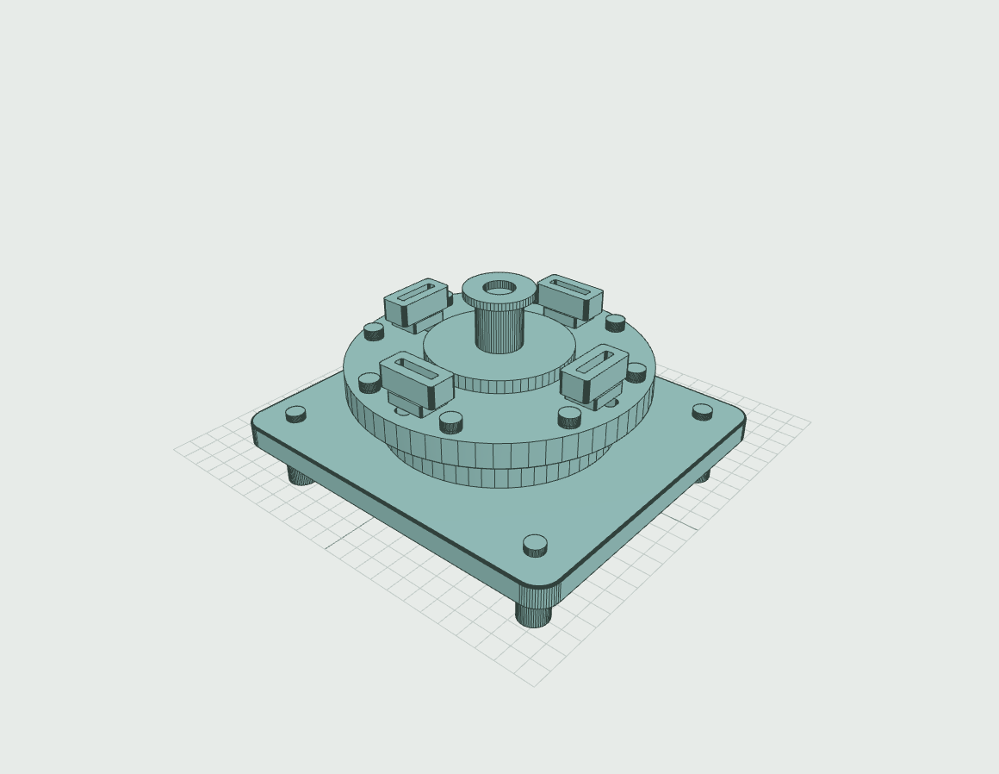

# PlainCAD example projects

Ten distinct editable mechanical designs, from two parts to forty. All were
rebuilt with the real OpenCascade browser worker, edited through a driving
parameter, saved/reopened, and exported as separate validated STL files.
These are learning and workflow examples, not production-qualified mechanisms.

## Open and explore

1. Download a `.pcaddoc` file below. On GitHub, use the file's **Download raw file**
   action; do not save the GitHub HTML page.
2. In PlainCAD, choose **File → Open project**, or drop the file onto the workspace.
3. Open **Project** on the left. Search for a component, then **Activate** or
   **Isolate** it. Use **All tools → Show All Bodies** to restore the entire design.
4. Open the **Parameters** tab and try the specific edit in the table. Undo restores
   the original. The tested edits are examples, not a guarantee for arbitrary values.
5. Use **Fit** (or `F`) after opening a dock. On a compact viewport, find **Fit View**
   through **All tools**. Open **History** to inspect sketches and feature steps.
6. **Save** downloads an editable local project. **File → Export STL** opens body
   selection; use **Separate files (ZIP)** for these multi-part examples. The ZIP
   preserves world positions. **File → Download project view PNG** captures the view;
   select a body for an isolated part PNG, or open a sketch for its drawing PNG.

Parts means modeled component bodies; each project also has an empty root named
**Project reference**. Components share project coordinates. There are no assembly
joints, motion, placement transforms, nested assemblies, threads, or engineering
load calculations. Clearance and inter-body interference are not qualified.
Some non-mating components deliberately have display clearances. Sketch points are anchored
with fixed constraints for reliable example rebuilds; the named parameter is the
supported starting point for editing each design.

## Gallery

| Project | Parts | Features / sketches | Complexity | Try this parameter edit (mm) |
|---|---:|---:|---|---|
| [Cable guide mount](01-cable-guide.pcaddoc) | 2 | 4 / 3 | Beginner | `foot_thickness`: 5 → 6 |
| [Precision spacer stack](02-spacer-stack.pcaddoc) | 3 | 3 / 3 | Beginner | `spacer_height`: 20 → 24 |
| [Angle bracket fixture](03-angle-fixture.pcaddoc) | 3 | 7 / 6 | Beginner/intermediate | `web_height`: 36 → 40 |
| [Elevated instrument panel](04-panel-standoffs.pcaddoc) | 5 | 7 / 7 | Intermediate | `post_height`: 18 → 22 |
| [Motor mounting flange](05-motor-flange.pcaddoc) | 6 | 16 / 15 | Intermediate | `flange_thickness`: 8 → 10 |
| [Flanged valve cartridge](06-flanged-valve.pcaddoc) | 8 | 16 / 15 | Intermediate/advanced | `valve_height`: 32 → 36 |
| [Parallel robot gripper concept](07-robot-gripper.pcaddoc) | 11 | 22 / 22 | Advanced | `jaw_span`: 56 → 60 |
| [Twin-pulley drive cassette](08-belt-drive.pcaddoc) | 18 | 29 / 28 | Advanced | `pulley_height`: 10 → 12 |
| [Sixteen-tube heat exchanger](09-heat-exchanger.pcaddoc) | 28 | 37 / 37 | Highly complex | `tube_length`: 148 → 152 |
| [Rotary machining fixture concept](10-rotary-fixture.pcaddoc) | 40 | 68 / 66 | Highly complex | `platter_thickness`: 14 → 16 |

Only the paired parameter values above were verified. Fixed dimensions outside
those expressions do not automatically follow arbitrary feature edits. In particular:

- Spacer washer thickness stays at 4 mm; the angle fixture's holes/pins stay at Z=25 mm.
- The angle fixture's “Web fastener” components represent smooth alignment pins
  without heads or retention. All fasteners are unthreaded teaching representations.
- The gripper has a thin 0.6 mm pocket-to-pivot wall at its default size; it is not
  a manufacturing-ready palm, and smaller jaw spans are not qualified.
- The drive cassette's cover and shaft lengths are fixed; larger pulley-height
  changes can exceed that envelope.
- The rotary platter has 1 mm clearance to the shoulder. Its screw engagement,
  washer/head proportions, support, and retention are illustrative, not qualified.

Preview images come from PlainCAD’s actual project PNG export, with sketch overlays
hidden. They depict native geometry, not generated illustrations.

### 1. Cable guide mount

Two-piece rounded foot and annular cable guide with mounting holes.

[Download editable project](01-cable-guide.pcaddoc)

### 2. Precision spacer stack

Three annular parts with a shared bore and parameter-linked upper washer position.

[Download editable project](02-spacer-stack.pcaddoc)

### 3. Angle bracket fixture

An L-shaped joined bracket and two horizontal fasteners; front-plane drilling tests coordinate orientation.

[Download editable project](03-angle-fixture.pcaddoc)

### 4. Elevated instrument panel

A rounded drilled panel over four hollow supports, with a shared post-height parameter.

[Download editable project](04-panel-standoffs.pcaddoc)

### 5. Motor mounting flange

Six parts: a filleted flange with a raised bearing boss, relief slots, shaft and four headed fasteners.

[Download editable project](05-motor-flange.pcaddoc)

### 6. Flanged valve cartridge

Eight parts: bored valve body, cover, plunger, gasket and four bolts, with matched hole patterns.

[Download editable project](06-flanged-valve.pcaddoc)

### 7. Parallel robot gripper concept

Eleven static parts: pocketed palm, slotted jaws, pins, contact pads and four fasteners.

[Download editable project](07-robot-gripper.pcaddoc)

### 8. Twin-pulley drive cassette

Eighteen parts: windowed cover, stepped pulleys, bearings, shafts, spacers, columns and fasteners. Belt geometry and motion are not modeled.

[Download editable project](08-belt-drive.pcaddoc)

### 9. Sixteen-tube heat exchanger

Twenty-eight static parts with side-plane tubes, bored headers, a windowed guard and support hardware.

[Download editable project](09-heat-exchanger.pcaddoc)

### 10. Rotary machining fixture concept

Forty static components, a turned hub, slotted platter, bearing stack, four clamps and extensive fastening hardware. No rotary joint or machining simulation.

[Download editable project](10-rotary-fixture.pcaddoc)

## Validation and usability findings

[VALIDATION.json](VALIDATION.json) records this run's per-body BRep validity,
solid count, exact volume, mesh bounds, parameter edit/undo results, save/open
checks, and decoded binary STL measurements. Across the ten projects: **124 native
bodies, 209 features, and 202 sketches**. Every final body is one valid solid with
positive exact volume. Every ZIP has the expected number of uniquely named STLs;
all coordinates are finite, and signed mesh volumes are positive. The largest
observed tessellated-volume difference from BRep was below **0.18%**.

The angle fixture independently checks XZ extrusion along negative Y; the heat
exchanger checks sixteen YZ tubes along positive X against their analytical annular
volumes. XY bases start at Z=0. Native rebuilds in this development Chromium run
ranged from approximately 33 ms to 3.5 s, excluding kernel startup. These timings
are observations, not a performance guarantee.

Full separate-file mesh checks validate each body; they **do not** establish
cross-body fit or perform cross-body overlap checks. Save/open equality checks
cover the durable document, not runtime camera/visibility state. The automated
checks exercised real browser workers; the UI walkthrough separately used visible
controls. This is a recorded validation snapshot, not a new continuous test gate. The temporary
authoring/verification scripts are not distributed; per-project SHA-256 hashes
identify stale evidence if a file changes.
No application runtime code changed, so the full release suite was not rerun.

[Read the screenshot-backed workflow audit](WORKFLOW_AUDIT.md) for the manual
sketch-to-solid walkthrough, complex-project navigation, and prioritized UI fixes.
The ten gallery projects were authored using the existing immutable document
helpers; they were not all drawn by hand through the UI. No AI provider call was
needed to create their geometry.

The earlier single-body [ORBIT drive housing](orbit-drive-housing.pcaddoc) remains
available as an additional example.
