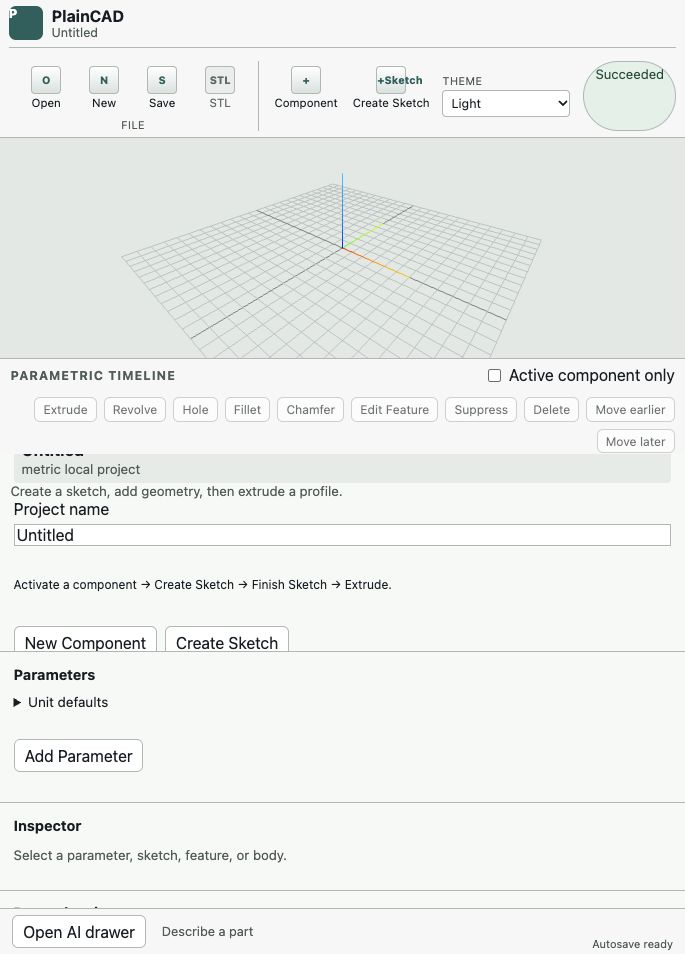
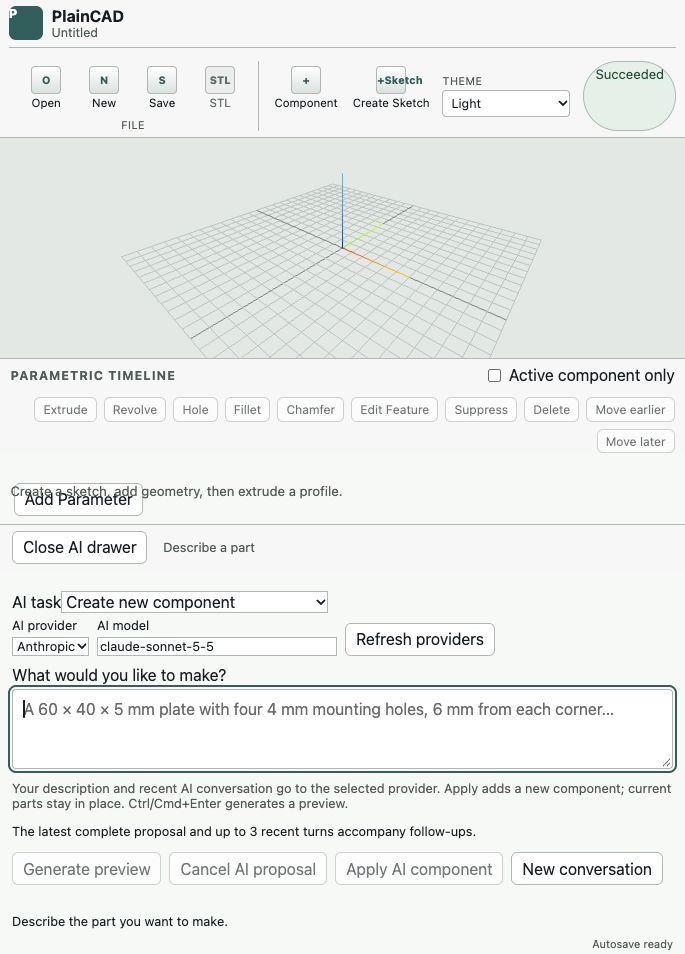
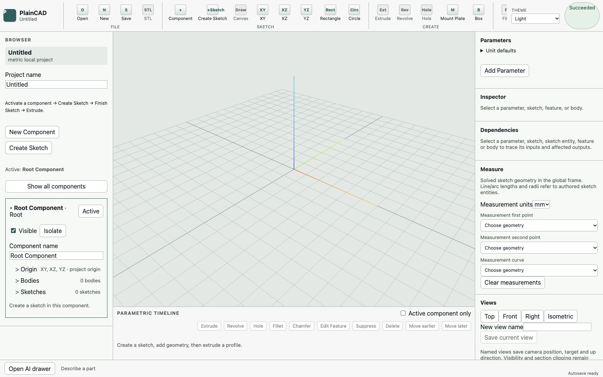
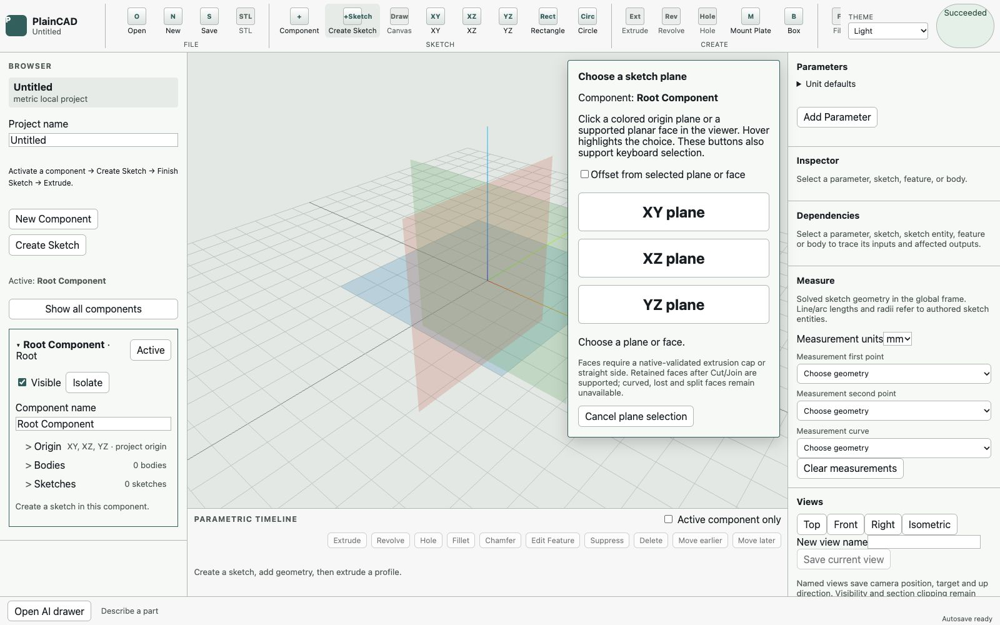
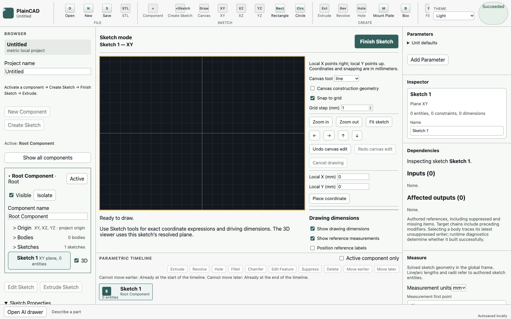

# Making PlainCAD simple to use

Status: Step 1 presentation changes implemented; Steps 2–5 remain proposals. Updated October 5, 2026.

The screenshots capture the interface before Step 1. The proposed drawing, handle,
drag-and-drop and AI-routing interactions below remain planned unless explicitly
listed as existing in the implementation section.

## 1. The proposed direction

PlainCAD should let someone **draw what they mean, describe what they want, and adjust what they see**. A person should be able to make a useful mechanical part without first learning components, sketch planes, constraints, body scopes, or feature history. An experienced CAD user should retain precise control over every supported operation.

The recommended default experience is a large modeling canvas, a small set of relevant tools, and one contextual task panel. Mouse drawing and direct manipulation should be primary interactions. AI should translate intent, suggest the next useful action, explain problems, and prepare validated changes. Detailed CAD controls should appear when requested or required by the task.

This is a presentation and interaction change built on the existing parametric model. All three ways of working—drawing, AI, and precise controls—must produce the same editable document, use the same geometry checks, and share undo/redo. Moving between them must never flatten geometry or lose design intent.

The product goal is broad usability across CAD experience levels. That is a goal to test with people, not a claim that one interface will automatically suit everyone.

## 2. What the current interface makes difficult

A focused interface audit was captured in a separate in-app browser session on October 5, 2026. It covered a blank project, opening the AI drawer, plane selection, and entering sketch mode. No provider generation requests were sent. The screenshots below are current-run evidence; recommendations elsewhere in this document are proposed changes.

| Screenshot | Observed state and health | Main issue and proposed response |
| --- | --- | --- |
| 1 | Compact empty project: crowded | Viewer, timeline, component controls and properties compete vertically. Use a canvas-first layout with one active drawer. |
| 2 | Compact AI entry: useful but demanding | Task, provider, model and conversation controls appear before the description. Lead with intent; move configuration into AI settings. |
| 3 | Desktop empty project: capable but overwhelming | Multiple persistent panels and disabled commands appear before there is geometry. Show a clear starting choice and defer secondary tools. |
| 4 | Plane selection: explicit but technical | XY/XZ/YZ and topology limits require vocabulary the user may not know. Add spatial names, previews and contextual defaults. |
| 5 | Sketch mode: powerful but fragmented | Drawing, coordinates, dimensions and constraints coexist with component, dependency and timeline UI. Concentrate the screen on drawing and the selected object. |

### Screenshot 1 Compact empty project

The viewer has recognizable spatial feedback, and the UI explains a sketch-to-extrude sequence. However, empty timeline commands and component-management fields occupy substantial space. Some section content appears crowded or visually overlapping in this captured compact layout. This warrants responsive-layout testing rather than assuming the desktop arrangement can simply stack.

### Screenshot 2 Compact AI entry

The prompt includes a useful mechanical example and explains preview/Apply. The user still has to distinguish creation from two edit tasks and confront a provider/model identifier. Keep a visible target summary, but hide routine provider administration behind a named settings control.

### Screenshot 3 Desktop empty project

The project hierarchy and exact-property interfaces provide a strong foundation for power users. On a blank project, Parameters, Inspector, Dependencies, Measure and Views are already present, while many ribbon and timeline commands are unavailable. The ribbon is visually crowded near its right edge. The main next action does not dominate these competing controls.

### Screenshot 4 Plane selection

Plane highlighting and keyboard-selectable buttons are useful. Present “Top (XY), Front (XZ), Side (YZ)” with orientation previews, retaining the technical names. Put detailed topology limitations under Details, while keeping a concise reason visible whenever the chosen face is unsupported.

### Screenshot 5 Sketch mode

Finish Sketch is prominent, exact coordinates are available, and drawing dimensions are enabled by default. Much of the screen still concerns other tasks, and the drawing tool is selected through a dropdown. Prefer a short visible drawing toolbar and an inspector driven by the selection. Retain exact coordinate authoring in Precision controls.

### Evidence limits

This is a bounded inspection of interface states, not a complete modeling or accessibility audit. It did not test screen readers, every keyboard path, contrast ratios, all themes, all breakpoints, or drag interactions. It did not establish task-completion rates with users. The captured compact and desktop states suggest density and discovery risks; formal accessibility defects require additional testing. Existing native acceptance tests establish specific geometry workflows, not that beginners find them easy.

## 3. Principles that should govern the redesign

1. **Start with the user's object or goal.** “Make a plate” or “Draw a shape” should be more prominent than parameter administration.
2. **Show tools for the current task.** Sketching should look like drawing; exporting should look like choosing what to manufacture.
3. **Keep control locations stable.** Context changes may change panel content, but should not scatter primary actions around the screen.
4. **Make precision optional to start and easy to add.** Rough mouse input can be refined with dimensions, constraints and expressions.
5. **Show what will change before changing it.** AI and feature operations require a current validated preview and explicit Apply.
6. **Keep expert access immediate.** Search, shortcuts, Details and pinned panels must reach supported advanced tools without mandatory tutorials.
7. **Explain uncertainty and failure.** Unsupported geometry, approximate input and invalid references must remain visible and actionable.
8. **Make AI helpful without making it mandatory.** Drawing, templates, editing, file handling and fabrication must work without a provider.

Progressive disclosure supports exposing common controls first and specialized options on request; discovery of the secondary controls must remain obvious. This principle informs the proposal, rather than proving this particular layout will succeed. [Nielsen Norman Group: Progressive Disclosure](https://www.nngroup.com/articles/progressive-disclosure/)

## 4. One workspace with adjustable detail

Use a default **Focused** layout and an optional **Full workspace** layout. Avoid an experience-level gate at startup. A beginner may need one advanced option; an expert may prefer a quiet screen.

In Focused layout, show the canvas, current target, Undo/Redo, a small task toolbar, one task panel, and the bottom AI entry. A visible Details control expands the active task's precise options. Full workspace exposes the project tree, history, parameter table and optional inspection panels. Users can pin individual panels in either layout.

The layout preference changes presentation only. It must not change command semantics, capabilities, saved geometry, selection scope or validation. Do not automatically switch someone to Full workspace because AI guesses that they are experienced.

| Workspace region | Default behavior | How additional power is revealed |
| --- | --- | --- |
| Top bar | Project name, File, Undo/Redo, task tools, Export | All tools menu and searchable commands; appearance in Settings |
| Left edge | Compact Parts button; list appears when needed | Expand tree to components, bodies, sketches and origin |
| Canvas | Main work area with selected geometry and relevant handles | Optional grid, measurements, section view and precise picking |
| Right task panel | Current drawing, feature, property or repair task | Details expands exact expressions, scopes and supported references |
| Bottom history | Compact History affordance; hide empty timeline | Expand chronological history; pin in Full workspace |
| Bottom AI drawer | “Describe or change your part…” entry, user-controlled expansion | AI settings, context inspection and conversation management |
| Model status | Short current state and issue count | Open source-linked diagnostics and technical details |

Keep one primary task panel active. Opening Measure should replace ordinary property content for that task, while pinned expert panels remain user-controlled. Do not silently discard pending form values when selection changes; require Apply/Discard or keep the draft clearly associated with its original target.

## 5. Deterministic rules for hiding and showing UI

Adapt to explicit task state and selection. AI may suggest an action; it should not decide which controls disappear. Hover alone must not reshape the workspace.

| State | Show first | Defer until requested | Primary action |
| --- | --- | --- | --- |
| Empty project | Describe, Draw, Start from example, Open project | Empty history, dependencies, body scopes, constraint forms | Start a part |
| Plane selection | Spatial plane choices, supported face highlight, Back | Offset expression and reference details | Choose surface |
| Drawing sketch | Select, Line, Rectangle, Circle, Arc, Dimension, Finish | Entity lists, construction options, solver internals, other workspace panels | Finish shape |
| Closed region selected | Region highlight and Make solid action | Thickness controls until the tool starts; profile/reference details | Make solid |
| Extrusion draft | Thickness handle, typed thickness, direction and material mode | Profile IDs, advanced termination and scope details | Apply after native validation |
| Body selected | Useful dimensions, supported Add/Cut/Hole actions | Full feature table, raw expressions and dependencies | Change part |
| Feature selected | Relevant dimensions and Edit | Reorder, suppress and reference repair details | Preview change |
| AI preparing | Scope, progress, Cancel | Unrelated editing controls | Wait or cancel |
| AI preview ready | Current target, changed values, assumptions, Apply/Discard | Recipe and detailed validation evidence | Apply change |
| Invalid model or draft | Affected geometry, reason, next repair action | Unrelated property panels | Repair or undo |
| Export task | Body choice, file format, readiness and meaningful warnings | Tessellation settings, native union and mesh details | Export file |

Always retain project identity, the edit target, Undo when available, Cancel for a draft, model readiness, and access to File, All tools and AI settings. Errors and export-blocking warnings must remain discoverable even when their originating panel is hidden.

Hide irrelevant commands from the short contextual toolbar. Keep supported but currently unavailable commands discoverable in All tools with a useful prerequisite, such as “Draw a closed shape first.” Unsupported capabilities must carry an explicit limitation and remain unavailable everywhere.

Do not collapse a panel during typing, keyboard navigation or an active pointer gesture. Respect manually pinned/open panels. Treat changing context during a draft as an intentional transition, not a cosmetic hide/show event.

## 6. Simplify Project, Component and Sketch

Retain the durable hierarchy but introduce it through understandable labels:

| User-facing term | CAD meaning | Explanation when needed |
| --- | --- | --- |
| Project | One local CAD document | The file containing all parts and their design history |
| Part | Component | A named group of sketches, features and bodies |
| Shape | Sketch | A flat drawing used to build or cut material |
| Solid | Body | A connected result that can be inspected and exported |
| History | Parametric timeline | The ordered editable steps used to make the parts |

The CAD meaning column contains the technical term shown in tooltips or Details. Shape always means a 2D drawing on a plane, including when displayed in the 3D viewer; Solid means a 3D body. Use stable primary labels across layouts; pair technical names in tooltips or Details. Do not rename commands dynamically according to a guessed skill level.

A first drawing should not require the user to name a component or activate Root Component. The task can prepare an ordinary component draft named “Part 1” and publish it with the first committed modeling operation. Define that transaction explicitly: canceling before publication leaves no accidental empty part, and applying creates ordinary stable IDs in a predictable undo step.

For multi-part projects, show an always-visible target chip such as **Editing: Bracket**. Clicking a visible part selects it; choosing Edit also activates its component through existing rules. Selection and activation remain distinguishable. Ghosting other parts is a temporary view effect with an obvious Show all action.

Creating another part is **New part**. Sketches inherit its active target, and manual actions visibly report their target. Existing root-owned projects remain valid; do not migrate component ownership merely to simplify labels.

## 7. Make drawing with the mouse the main manual path

### Start with an understandable surface

Draw on an empty project offers a recommended Top plane with a visible orientation preview. Clicking a supported planar face offers **Draw here** and aligns the canvas. Front and Side remain easy choices. Explicit face references and offsets remain available in Details; unsupported faces explain why drawing cannot start there.

### Draw roughly, then make it exact

Show direct drawing tools rather than putting the core tools in a dropdown. Rectangle supports corner-to-corner dragging; an optional center mode remains available. Circle supports center-to-radius dragging. Lines use click-to-place connected vertices, and arcs use a named supported construction method with visible intermediate feedback.

While drawing a rectangle, show width and height near the cursor. Typing a number fixes the active dimension; Tab moves between width and height; Enter accepts the draft. A separate visible size form provides the same action. Project units interpret bare numbers, and explicit units or expressions remain available. A rough 58.7 × 39.2 shape can become 60 × 40 without redrawing.

The drawing gesture defines initial shape; driving dimensions define its subsequent size. Do not create dozens of parameters for every pointer movement. Provide **Keep editable** or **Name this dimension** to promote useful values into named parameters.

### Make snapping understandable

Preview grid, endpoint, center, horizontal and vertical snaps with a marker and short label. Use screen-space picking tolerances, not world distances that change unpredictably with zoom. Provide a visible Snap toggle and temporary modifier. Add only supported, solver-validated persistent constraints; a positional snap is not automatically a permanent constraint.

When automatic relations would conflict with existing dimensions, show the rejected relation and preserve the previous valid state. Do not silently remove constraints to satisfy the gesture. Suggest anchoring or centering a shape as an explicit action rather than locking every new point.

### Make selection and camera gestures predictable

Primary click selects; empty-space drag in sketch mode can draw a selection box when Select is active. Dragging an explicitly highlighted point or handle edits its supported degrees of freedom. Middle drag or Space+drag pans; wheel zooms; a visible Fit button restores framing. In 3D selection mode, dragging empty space or using a dedicated Orbit control can orbit the camera. An active modeling tool reserves its handle gestures; use the dedicated Orbit control to change the view during that task. Camera orbit must not compete with a modeling drag on the same pointer gesture.

Define a small drag-start threshold, initially 6 CSS pixels as a testable proposal, to avoid accidental edits on click. Capture the pointer for a started gesture, cancel on Escape or lost context, and provide equivalent click-and-type controls. Touch behavior needs separate validation; do not assume mouse hover interactions transfer to touch.

### Keep dimensions visible without filling the canvas

Preserve dimensions-on-by-default. Give priority to selected driving dimensions, values being edited, and dimensions relevant to the current operation. Dim or group unrelated reference measurements when crowded. Allow **Show all dimensions** and pinning. Never hide an invalid active dimension or confuse a measured reference value with a driving value.

Click a driving dimension to edit it inline; expose units and expressions in Details. Click a reference measurement to inspect it or explicitly add a supported driving dimension. Constraint glyphs appear for selected geometry and problem locations; Show all constraints remains available.

## 8. Direct manipulation of solids without losing parametric history

A closed sketch region should highlight as material. Choose **Make solid** to reveal a normal-aligned **Thickness** handle. The technical operation is Extrude, shown in Details. Dragging the handle changes a transient distance preview; typing gives exact distance. Show direction and a world-orientation cue so XZ's negative-Y normal is not mistaken for positive Y.

For this operation, the Mode field offers **New solid**, **Add material** and **Cut material**. **Make solid** remains the stable action label; these are explicit material modes, and **Apply** commits the preview. An inferred mode is only a suggestion. Display the actual mode and target body before Apply, and require explicit scope when several bodies are candidates. The ordinary document feature records that choice.

Editing a supported extrusion's thickness handle updates that feature's distance. It must not move arbitrary mesh vertices or imply general BRep face editing. When a face has several plausible owning features, request the intended feature instead of guessing.

A bound dimension remains bound unless the user explicitly chooses to replace its formula. If thickness depends on a shared parameter, show its name and affected parts; offer editing the parameter or editing the feature through the supported binding-replacement behavior. Do not hide that distinction behind a drag gesture.

Use lightweight transient feedback while dragging. Rebuild exact native previews at a controlled cadence or when the gesture settles; queue only the latest request and preserve stale-result rejection. Estimated feedback must be labeled as pending, and Apply stays unavailable until current geometry validates. Pointer movement must not create a history entry; one accepted change creates one undo step.

## 9. Drag and drop should express intent

Drag-and-drop is a discoverable shortcut when valid targets light up and a short explanation follows the cursor. Every drop must resolve a target and preview an ordinary document operation. Provide a click/select/place alternative for each action.

| Dragged item | Valid destination | Intended result and limits |
| --- | --- | --- |
| Rectangle/circle tool | Active sketch canvas | Start a draft shape; finish placement or type dimensions |
| Draw action | Supported planar face | Start face-based sketch selection; show orientation and offset |
| Closed sketch/profile | Supported target in an Add/Cut task | Prepare an explicit extrusion with profile, direction and body scope; do not imply arbitrary 3D relocation |
| Hole tool | Supported face/body | Open a guided points-sketch and Hole draft, with centers and targets explicit; build this compound UI workflow first |
| Round/Bevel tool | Supported feature-owned perimeter | Prepare real Fillet/Chamfer; invalid or arbitrary edges remain unavailable |
| Existing `.pcaddoc` file | Workspace open zone | Validate then open; handle unsaved work; do not silently merge imported JSON |
| Built-in example | Start/example zone | Clearly say whether it opens a project or creates a part; retain current replacement semantics until append is implemented |
| History item | Valid chronology position | Preview/check a supported timeline reorder with dependency validation |
| Reusable saved part | Library drop zone | Future capability requiring validated append, ID remapping and expression/reference repair |

During drag, eligible targets get both an outline and a label. Unsupported targets explain the limitation without flooding the screen. Drop on empty space cancels or opens a deliberate placement prompt; it never invents coordinates, component ownership or a modeling scope.

Hover does not commit. A modeling drop opens a preview with Apply/Cancel. Routine validated file-open gestures use ordinary file actions and protect unsaved work. Network requests should not start merely because something was dragged over the canvas.

Do not advertise free component movement, assembly mates, imported STL editing, arbitrary edge fillets, or general face deformation through a generic drop cursor. These require additional geometry/document support. A part may be reorganized in a future project tree only after ownership and downstream references can be preserved safely.

## 10. Let AI reduce decisions and explain the model

### Lead with one prompt and an explicit target

The AI entry should read **Describe or change your part…**. Show scope chips such as **New part**, **Edit Bracket**, or **Edit Extrude 2**. Suggest scope from selection but require an explicit switch when ambiguous. Provider/model preferences belong in AI settings, with the active provider still visible in a compact status line.

Selecting a part and asking “make this thicker” should route to a supported parameter or feature edit only when the target dimension is unambiguous. Otherwise ask “Do you mean the plate thickness or the boss height?” with geometry highlights and selectable answers. Scope routing must be validated locally; prose cannot grant broader modification access.

### Ask only consequential questions

For a mounting plate request, essential questions may include its size and hole layout. Offer editable defaults with labeled assumptions when reasonable. Use one concise question at a time and small answer choices. Avoid asking users to configure planes, component names and kernel details that the system can resolve within the supported recipe.

Before preview, summarize the plan in plain language: “Create a 60 × 40 × 5 mm plate with four 4 mm holes.” During preview, surface key dimensions as editable cards, alongside highlighted geometry. Numerical refinements should use local native re-preview whenever possible instead of another paid AI call.

### Treat AI as a collaborator with clear boundaries

AI can create a supported recipe, propose a bounded existing-parameter edit, or propose selected Hole/Extrude/Revolve dimension edits today. Freeform sketch interpretation, arbitrary restructuring of existing features, assembly positioning and general direct face edits are not available simply because the interface describes them conversationally.

A proposed later feature, **Use this drawing**, would send a validated, bounded sketch-intent summary after the user chooses it. It should preserve authored IDs and dimensions, identify proposed corrections, and ask before changing geometry. Do not introduce raster-image guessing or unrestricted project upload as an invisible shortcut.

AI explanations should distinguish geometric validation from manufacturing suitability. “Native model validated” does not establish that a part fits, is strong enough, or is ready for a specific process. Do not display invented confidence percentages. Explain what was actually checked and any assumptions that remain.

Microsoft's human-AI guidelines emphasize capability expectations, context relevance, correction and user control. Apply those principles to visible scope, preview, cancellation and actionable failure messages. [Microsoft Research: Guidelines for Human-AI Interaction](https://www.microsoft.com/en-us/research/articles/guidelines-for-human-ai-interaction-eighteen-best-practices-for-human-centered-ai-design/)

### Make AI failure usable

When a provider returns an invalid recipe, show “This proposal could not be built. Your part is unchanged,” followed by the specific actionable reason and options to revise the request, use a template, or continue drawing. Keep retry user-triggered; do not silently spend additional API calls on repair loops.

When AI is unavailable, explain whether no provider is configured, the gateway is absent, or a request failed. Offer **Draw instead** and **Start from example** immediately. Setup instructions live in AI settings; the first-use workflow must not require everyone to learn environment variables.

The current gateway is local development/preview infrastructure. A simple end-user hosted AI setup needs a separately designed authenticated service; the UI redesign does not provide that service. Existing server credentials must stay out of browser code and project files.

## 11. Three example journeys

### A First part by drawing

1. Choose Draw; accept the visible Top plane.
2. Drag a rectangle; type 60, Tab, 40, Enter.
3. Select the shaded region and choose Make solid; drag or type 5 mm.
4. Inspect the validated preview and Apply.
5. Choose Hole on a supported surface, place centers with the mouse, and type diameter 4 mm. The UI prepares ordinary points/Hole data and confirms target/direction.
6. Apply the validated cut; click thickness to change it later.
7. Save project or Export STL.

This is the intended future flow. The simplified controls and compound hole-placement interaction still require implementation; current manual commands remain the foundation.

### B First part by description

1. Type a mechanical description without choosing a provider/model every time.
2. Resolve missing essentials or accept clearly shown defaults.
3. Inspect native geometry and editable dimensional cards.
4. Apply once; see an ordinary part with editable history.
5. Continue using dimensions, mouse tools, or another supported AI edit.

The existing preview/Apply and local dimensional refinement provide much of this path. Scope routing and the quiet layout are proposed additions.

### C Experienced user refining a part

Select a feature from history, expand Details, edit a formula or supported reference, inspect dependencies if needed, validate the entire downstream rebuild, then Apply. Pin Parameters and History for repeated work. Use shortcuts and search without opening the AI drawer. The same file remains editable in Focused layout.

## 12. Contextual repair should replace diagnostic hunting

Replace a generic wall of diagnostics with a short issue card linked to the affected geometry. Keep the full diagnostic available under Details.

| Problem | Plain-language message | Next action |
| --- | --- | --- |
| Open profile | “This shape has a gap, so it cannot become a solid.” | Highlight endpoints; zoom to gap; suggest an explicit supported connection |
| Conflicting dimensions | “These two dimensions disagree.” | Highlight both; edit or remove one deliberately |
| Lost face reference | “The surface used by this sketch changed.” | Pick a supported replacement and preview the result |
| Invalid cut scope | “This cut does not reach the selected part.” | Show direction, depth and targets; edit or cancel |
| Unsupported edge treatment | “This edge cannot be rounded with the current tool.” | Highlight supported feature-owned perimeters or show the limitation |
| Stale preview | “The part changed. Update the preview before applying.” | Re-preview current intent; retain safe editable draft values |

AI may explain a diagnostic or prepare a proposed fix. It must not silently delete constraints, replace references, resize holes, suppress features or change target bodies to make a rebuild pass.

A failed operation preserves the last committed document. If old geometry remains visible for orientation, label it **Previous valid result** and keep export and picking governed by current validity. A visually plausible mesh must never be presented as proof of success.

## 13. Save and export should be two understandable actions

Use **Save project** for editable `.pcaddoc` data and **Export STL** for a fabrication mesh. Explain the distinction at the point of use: “Save keeps dimensions and history; STL contains a mesh.” Autosave is local recovery, not evidence that a portable file has been saved.

Default export to the single eligible selected part/body, with an explicit summary of what is included. For several eligible bodies, ask which to export. Expose separate-body, combined-shell and native-union modes with plain descriptions and existing overlap/mesh diagnostics; do not disguise their different outcomes.

Present readiness as current model validity plus mesh checks, rather than a broad “safe to manufacture” label. Keep units and output bounds visible. Advanced tessellation choices remain under Details. Export must use a successful current rebuild and the same supported validation paths as today.

## 14. Accessibility and responsive behavior

Mouse input and drag-and-drop should accelerate use, never become the only way to complete a task. Offer click source then click destination, an exact-value form, and keyboard equivalents for each proposed drag. WCAG's dragging criterion specifically addresses a single-pointer alternative without dragging; keyboard access is a separate requirement. [W3C: Dragging Movements](https://www.w3.org/WAI/WCAG22/Understanding/dragging-movements.html)

Use labeled buttons, meaningful focus order and visible focus. On opening a task panel, focus its heading or first relevant input; on closing, restore focus to the invoking control. The bottom AI drawer and floating toolbars must not cover the focused control. [W3C: Focus Not Obscured](https://www.w3.org/WAI/WCAG22/Understanding/focus-not-obscured-minimum.html)

Selected, invalid, pending and supported-drop states need text or shape cues in addition to color. Announce completed previews and meaningful errors, not every pointer move. Support reduced motion and prevent unsolicited camera movement. Every theme, including Saturn Command, should use the same layout and readable interaction states; decoration must not make critical status harder to read.

At narrow widths, use one active sheet rather than stacking both sidebars, history and AI. Keep the canvas and Apply/Cancel visible during a task. Test normal laptops, compact embedded views, increased text size and browser zoom. Desktop mouse usability should be delivered first; comprehensive touch modeling should be a separately validated scope.

## 15. Architecture and implementation boundaries

Use a deterministic UI task coordinator with states such as idle, choosing surface, sketching, drafting feature, preparing AI, reviewing preview, repairing and exporting. Selection, command availability, user-pinned panels and draft status determine the presentation. Reuse existing workflow stores and command sessions rather than letting each panel independently infer a mode.

The precedence is: blocking file/recovery flow; active modeling draft; active repair/export task; ordinary selection. AI should remain accessible as help, but a new AI modeling draft must not compete with an active sketch/feature draft. Switching tasks deliberately preserves, applies or discards intent before changing context.

Route toolbar, mouse, drop, palette and AI actions through shared commands and enablement. Derive supported geometry targets from the existing capability/reference rules. UI labels do not widen those rules.

Each modeling draft captures document/session/component/selection context. Parameter changes, file replacement, undo/redo, component changes and source-geometry changes invalidate affected previews. Maintain worker request/epoch checks and dispose superseded native/viewer resources. A draft's version must match the validated result before Apply.

Keep panel visibility, camera state, pointer drags, AI conversation and transient previews outside `CadDocument`. If new reusable-part metadata or named semantic dimension roles become durable data, evolve schema, migrations and validation together; do not infer permanent roles from display names alone.

A future semantic dimension index can map “plate thickness” to an explicit parameter or feature field and explain shared dependencies. Until then, AI scope routing must use the current bounded edit contexts and ask when meaning is ambiguous. A displayed bounding-box size is not automatically an editable design parameter.

Persist layout preferences locally, separately from project JSON. Pinning panels, Focused/Full layout and AI settings should survive reload when appropriate; in-flight drafts and kernel resources should not. Any later persisted chat feature requires explicit storage/privacy decisions and import limits.

Preserve current data disclosure: creation sends prompt/recent turns; bounded edit tasks send their existing parameter/feature metadata. New sketch/project context sharing needs a visible, inspectable bounded payload and explicit user action. Never send full project JSON, meshes or credentials as an automatic side effect of a selection or hover.

## 16. What exists and what needs to be built

| Area | Existing foundation | Proposed work |
| --- | --- | --- |
| Drawing | Pointer-authored lines/rectangles/circles/arcs, snapping, exact coordinates, bounded move/translate/deform | Visible tools, inline size entry, simpler selection and task presentation |
| Dimensions | Driving labels and reference measurements, enabled by default | Selected-value prioritization, direct contextual editors and discoverable naming |
| Features | Native extrude/revolve/Hole, booleans, bounded edge treatments and references | Parametric distance handles and guided surface-to-hole workflow |
| AI | Three providers, bounded recipes, existing parameter/selected-feature edits, native previews | Intent-based scope chips, simpler settings, targeted questions and contextual help |
| Organization | Project/components/sketches/bodies, activation and history | Quiet part list, automatic first-part transaction, explicit target context |
| Drag and drop | Existing file and command infrastructure; validated timeline movement | A shared drop registry, eligible-target highlights and preview transactions |
| Reusable content | Built-in examples and durable projects | Append/import-part design with ID and reference remapping; placement/assemblies deferred |
| Repair/export | Source-linked diagnostics, reference repair, STL modes and validation | Guided issue cards and a concise export task |

Current movement/deformation and topology references have bounded support. General constrained dragging, arbitrary BRep face manipulation, assembly positioning and unrestricted imported-part editing remain separate modeling projects. Consult `CAPABILITY_MATRIX.md` before exposing a proposed gesture.

## 17. Recommended implementation order

### Step 1 Reduce visible complexity

Implemented October 5, 2026: Focused default, optional Full workspace, an empty-project
start surface, compact Parts/History, one contextual Details panel plus user-pinned
panels, compact single-sheet switching, locally persisted presentation preferences,
and collapsed AI provider/model settings. Details panels mount on first use and
retain drafts while hidden. The
project hierarchy and supported CAD operations are unchanged; the first-part
transaction and simplified drawing interactions described earlier remain proposals.

Acceptance verified by `e2e/focused-workspace.spec.ts` on Chromium, Firefox and
WebKit: a blank project shows an obvious Draw/Describe/Example entry, no empty diagnostic tables, and no empty timeline command wall. Existing supported commands remain discoverable, correctly enabled and keyboard accessible. Layout preferences remain separate from the document schema and undo history.
The tests also complete a mouse-drawn sketch, native extrusion and cut, parameter
edit, save/open and STL export without switching to Full workspace.

### Step 2 Make sketching direct and precise

Implemented October 5, 2026: visible drawing tools, rectangle/circle mouse drag and
click workflows, inline width/height/diameter entry using project units or length
expressions, selection-driven size inspection/editing, Top/Front/Side plane choices
with axis/normal hints, and a compact Focused sketch inspector. Sized primitives
and driving dimensions form one undo edit; rectangle constraints preserve shape
on later size edits. Dimensions remain enabled by default. Focused layout dims
unselected dimension labels and reduces satisfied constraint markers to selected
geometry; errors and unavailable values remain visible. Advanced controls and full
lists stay available through disclosures and expanded in Full workspace.
Selected sketch geometry can be deleted with a visible button or Delete/Backspace
while the canvas has focus. The item list supports selection even when geometry
cannot render. Deleting a point removes its attached curves and affected dimensions/
constraints in one undo edit. Unused endpoints and centers of deleted curves are
removed too; shared points, surviving references and hole centers remain. Unrelated
standalone points are preserved. The UI shows the
impact before deletion. Missing downstream profiles remain diagnostic.

Acceptance is covered by unit/component and native browser checks for precise
non-template sketches, all origin-plane orientations, dimension errors/recovery,
undo/redo, save/open and STL. User research is still required to establish that new
CAD users find the workflow easy. Box selection, additional snap types and new
sketch camera gestures described earlier remain future work.

### Step 3 Add parametric handles and bounded drag and drop

Start with extrusion distance handles and file-open drops. Then add supported face-to-sketch and guided Hole drops, bounded edge-treatment drops and validated history reordering. Define all alternatives, preview contexts and invalid-target messages before each gesture ships.

Project-file drops are implemented: drop one `.pcaddoc` or `.json` file to validate
and open it. Nonempty projects get explicit keep/save/replace choices; invalid,
stale, multiple-file or active-task drops preserve the current document. This opens
a project and does not append reusable parts or place assemblies.

Acceptance: drag and typed input produce equivalent feature data and native geometry. Cancel, pointer loss, stale selection and invalid geometry create no committed edits. An accepted operation is one undo step. Do not bundle reusable-part append or free assembly placement into this phase.

### Step 4 Make AI contextual

Add explicit scope chips, local bounded intent routing, concise clarification choices, a visual change summary and next-action suggestions. Keep existing provider security and native preview gates. Follow with optional sketch-intent assistance only after its context contract and ID-preservation design are ready.

Acceptance: “make this thicker” edits the intended supported field or asks a clear question; it never silently edits another part or shared value. Local numeric refinements do not generate API calls. Provider failure and absence leave manual workflows usable.

### Step 5 Guide repair and fabrication and validate usability

Add geometry-linked repair cards and the simplified export task. Run usability sessions, accessibility checks and cross-browser native workflows. Tune defaults from observations rather than counting how many controls were hidden.

Acceptance: users can recover from a gap, a conflicting dimension and a lost face reference; choose/export the intended bodies; and explain whether they saved an editable project or exported a mesh.

For each implementation step, follow the established workflow: focused behavioral and geometry tests, Prism review with Anthropic `claude-sonnet-5-5`, address actionable findings, run the full release gate for code changes, and commit separately. Only Step 1 presentation changes are implemented. Later steps remain planned.

## 18. How to prove that it is easier

Recruit people with no CAD experience, occasional makers and experienced CAD users. An initial study of five people in each group is a practical discovery proposal, not a statistical guarantee. Observe without teaching the interface first. Compare the same tasks in the current and proposed UI, balancing task order to reduce learning effects.

Use a small task set: create a plate and holes by mouse; make a sleeve by AI; change a dimension while preserving hole placement; repair a sketch gap; save/reopen; export a selected body; find an advanced formula/reference control. Include AI-unavailable and deliberately invalid-proposal conditions.

Record unaided completion, time to first valid solid, wrong-target edits, requests for help, repair success, discoverability of advanced tools, and whether users can explain the difference between preview and committed geometry. Ask a short ease rating after each task. Count clicks and visible controls as diagnostic signals, not the main success measure.

Proposed pilot goals: at least four of five participants per group complete the core create/edit/save/export task without intervention; no wrong-target committed edits; advanced tools found within two deliberate actions from the relevant task; median first-solid time reduced against the baseline. These are design targets to revise after the pilot, not existing results.

Automated acceptance must cover mouse, click-place and keyboard/form routes; cancellation and one-step undo; driving/reference distinction; invalid and stale native previews; constraints and shared bindings; XY/XZ/YZ orientation; multi-body scope; save/open; STL signed volume/bounds; AI offline/failure; panel focus restoration; and viewport/zoom behavior across themes. Use Chromium, Firefox and WebKit where affected. Keep paid provider tests opt-in and report failures honestly.

Recommended first deliverable: the quieter workspace and focused drawing tools, using existing CAD commands. These reduce daily friction before adding new AI reasoning or unsupported direct modeling. Then build the parametric handles and drop workflows that let users act on the geometry they can see.

## 19. Project references

The proposal is grounded in the current `src/app/App.tsx` shell, `ProjectWorkflowPanel.tsx`, `SketchCanvasPanel.tsx`, `AiDrawer.tsx`, shared command/workflow stores, `README.md`, and the working-CAD capability matrix. The screenshots document the inspected UI states; source and existing acceptance tests establish capability boundaries.

- [Current capability matrix](CAPABILITY_MATRIX.md)
- [Working CAD specification](SPEC.md)
- [Working CAD implementation plan](PLAN.md)
- [Application shell](../../src/app/App.tsx)
- [AI drawer](../../src/ui/panels/AiDrawer.tsx)
- [Sketch canvas](../../src/ui/panels/SketchCanvasPanel.tsx)
- [Project workflow](../../src/ui/commands/projectWorkflowCommand.ts)
- [Shared command registry](../../src/ui/commands/commandRegistry.ts)
